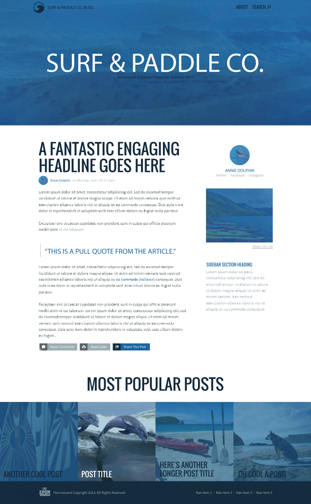

# CSS Reverse Engineering

## Description

Given screenshots of web pages (or parts of webpages), reproduce the look of each using CSS.


## Objectives

### Learning Objectives

After completing this assignment, you should...

* Understand the structure of HTML documents
* Understand CSS selectors, styles, and attributes
* Understand CSS pseudo-selectors

### Performance Objectives

After completing this assignment, you should be able to effectively...

* Use online tools like JSFiddle for rapid HTML and CSS experimentation
* Create simple HTML documents
* Style them with simple CSS documents

## Details

### Deliverables

* Links to your fiddles.

### Requirements

Your goal today is to reproduce webpages or components of webpages that you might find on the web.

Your work will probably proceed like this:

* Set up an account with JSFiddle.net.  Don't worry about registration fields you'd rather not enter.  Just leave them blank.
* You should be taken directly to a blank fiddle, but if you aren't, you can always type "jsfiddle.net" directly into your browser's address bar to be given a new fiddle.
* Whenever you change your HTML or CSS, you'll have to hit the "Run" button to see your changes.
* The first time you save, the button will be called "Save."  Every time after that, it will be called "Update." Regardless of its name, make sure to hit it often.  The "Run" button does NOT save by itself.
* When you are finished with each part of this assignment, MAKE SURE TO HIT UPDATE, then hit the "Share" button, then copy the first link and turn it in to your instructor.

## Easy Mode

The first task is to make a (terribly ugly) webpage containing one of Shakespeare's sonnets.  You will be making a webpage in JSFiddle that looks exactly like this:


So that you don't have to re-type the whole thing, [here is the sonnet in text form](http://www.poetryfoundation.org/poem/174354).  Pay attention to all the details, from color to font to borders.  Look down in the resources section for a tool that will help you compare your work with this image.

## Normal Mode

The second task is to make the following button:


The trick here is that you have to do all the work in CSS.  Your HTML must look exactly like this:

```
<span id="checkout">Checkout</span>
```

You'll need to look up and understand CSS "pseudo-selectors" to get this to work.  You'll probably also get confused about how to do things like multiple borders.  As with everything you don't know in software development, the best approach is to Google for something like "CSS multiple borders" and find a good post that describes how it can be done.

Again, make this pixel-perfect!

## Nightmare Mode

Note that we skipped "Hard Mode."  The third task is much, much harder, but if you'd like to really learn a lot about HTML and CSS, try to reproduce the following webpage:



To get this to work, you'll need to use a liberal number of nested divs, and will have to understand concepts like CSS positioning and CSS floating.  But really, don't keep yourself up late on Nightmare Mode.  This is just for those with extra time who want to poke around more (and it's a full Front End Engineering assignment in itself.)

## Additional Resources

* Mac's built-in screenshoting tool (CMD + Shift + 4, then draw a box around what you want).
* [Sip.app](https://itunes.apple.com/us/app/sip/id507257563?mt=12) for picking colors.
* [PerfectPixel](http://www.welldonecode.com/perfectpixel/) for checking pixel precision.
* I already mentioned this, but [Google](http://www.google.com)!!
